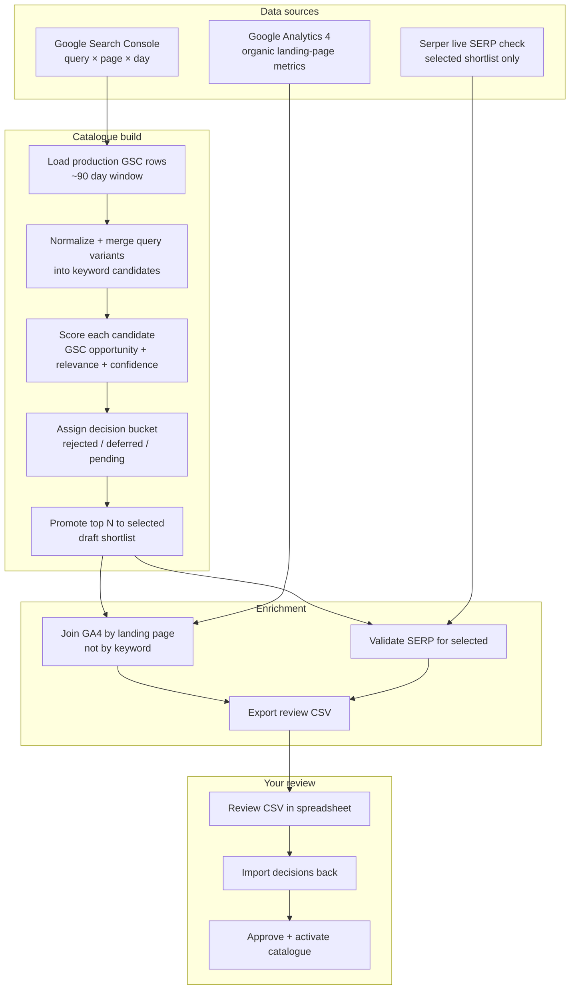
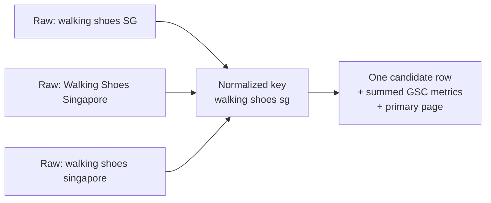
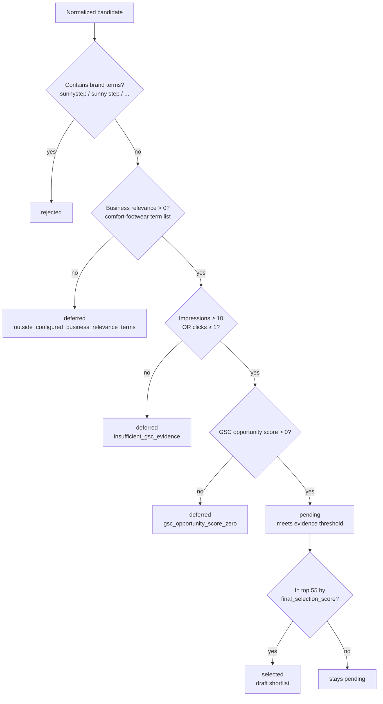
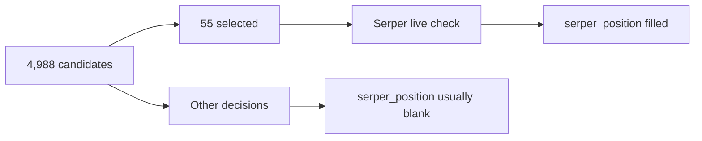
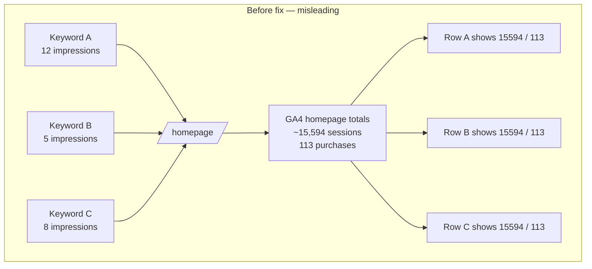
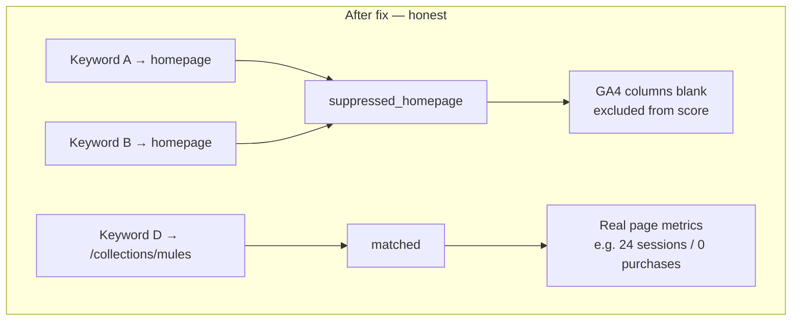
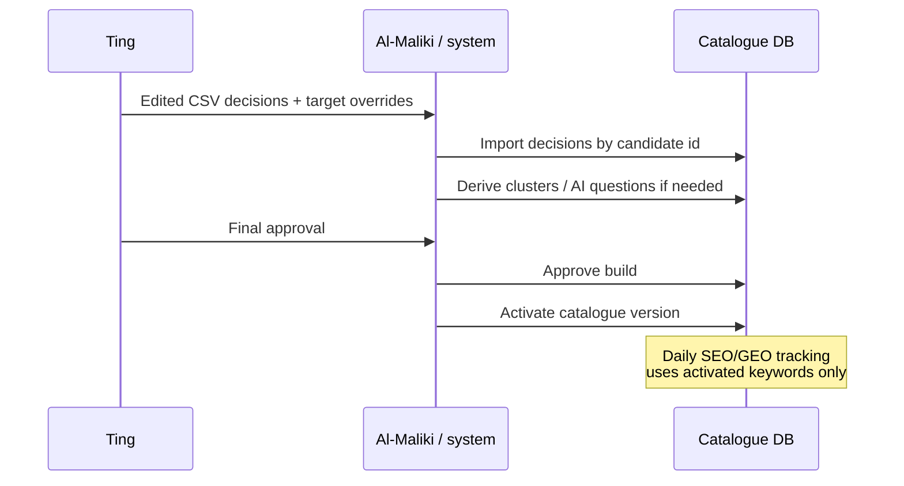

# Keyword Catalogue Review Guide

**For:** Ting  
**From:** Al-Maliki  
**Date:** 16 September 2026  
**File to review:** `keyword-review-serper.csv` (in Downloads)  
**Build ID:** `776935e6-1f27-4929-9480-56ae0ba86235`  
**Build status:** draft (awaiting your review)

---

## 1. Why this document exists

We are building an **evidence-based keyword catalogue** for Sunnystep — the set of search queries we will track going forward for SEO and GEO (AI-answer) measurement.

You have never seen this system before, so this note explains:

1. Where the rows in the CSV come from  
2. What each decision label (`selected` / `pending` / `rejected` / `deferred`) means  
3. How scores and metrics are calculated  
4. How to read every column in the CSV  
5. A real data problem we hit with GA4, and how we fixed it  
6. Exactly what we need from you

**Your job:** decide which keywords belong in the live tracking catalogue. The machine proposes; you approve, reject, defer, or change the target page.

---

## 2. What problem this solves

Without a provenance-backed catalogue, “keywords we track” can become an informal list that:

- mixes branded and non-branded queries  
- has no link back to Google Search Console evidence  
- cannot be audited (“why is this keyword here?”)  
- cannot be safely scored against GA4 commercial value or live SERP checks  

This pipeline produces a **reviewable shortlist with receipts**: every candidate can be traced to GSC rows, optionally enriched with GA4 page value, and optionally validated with a live Serper SERP check.

---

## 3. End-to-end pipeline (big picture)



### For this build (current CSV)

| Step | Result |
| --- | ---: |
| Raw GSC rows in window | 43,406 |
| Unique raw queries | 5,037 |
| Normalized keyword candidates in CSV | **4,988** |
| Auto-`selected` draft shortlist | **55** |
| `pending` (met evidence bar, not in top 55) | **423** |
| `rejected` (mostly branded) | **115** |
| `deferred` (weak evidence / off-scope) | **4,395** |
| GA4 window | 2026-06-17 → 2026-09-14 |
| Serper validated | 55 (the selected shortlist) |

---

## 4. Important principle: GSC ≠ keyword traffic in GA4

Please keep this distinction in mind while reviewing:

| System | What it knows | Grain |
| --- | --- | --- |
| **GSC** | Which **queries** showed our pages, clicks, impressions, position | query × page |
| **GA4** | What happened after people landed on a **URL** (sessions, purchases) | landing page |
| **Serper** | Where we rank **today** for a query in a live Google SERP | query (point-in-time) |

We **never invent** keyword-level purchases from GA4. GA4 can only tell us how valuable the **page** attached to a keyword looks. That join is useful — and dangerous if done naively (see §10).

---

## 5. How a keyword row is created

### 5.1 Source filter

Only **production** GSC rows are used (`source = gsc`). Demo / fixture / test runs are excluded.

### 5.2 Query normalization

Raw Google queries are cleaned into a stable catalogue key so near-duplicates collapse:

- lowercasing  
- punctuation → spaces  
- apostrophe variants merged (`women's` / `womens`)  
- whitespace collapsed  

Example: `Women's Walking Shoes` and `womens walking shoes` become one candidate.

Each candidate keeps:

- a **canonical display spelling** (highest-impression raw form)  
- **source receipts** linking back to every contributing GSC row (`source_refs` in the CSV)

### 5.3 Metrics aggregation

For each normalized keyword we sum / weight across the window:

| Field | Meaning |
| --- | --- |
| `gsc_clicks` | Total clicks |
| `gsc_impressions` | Total impressions |
| `gsc_weighted_ctr` | clicks ÷ impressions (not an average of daily CTRs) |
| `gsc_weighted_position` | Impression-weighted average position |
| `proposed_target_page` | The GSC page with the most impressions for that query (primary observed page) |

If the same query appears against multiple URLs, we flag **multi-page competition** (useful: the query may need a clearer target page).



---

## 6. Decision buckets — what the labels mean

Every row has a `decision`. These are **machine proposals for draft review**, not final law.



### 6.1 `rejected` (115 rows)

**Meaning:** Explicitly excluded from the v1 **non-brand** catalogue.

**Typical reason:** query matches brand rules (`sunnystep`, `sunny step`, `sunny steps`, etc.).

**Examples in this CSV:**  
`sunnystep shoes review`, `is sunnystep shoes good for walking`

Branded demand still matters for the business, but it is tracked separately from the non-brand opportunity catalogue we are building now.

### 6.2 `deferred` (4,395 rows)

**Meaning:** Not strong enough / not in scope for tracking *yet*. Kept visible so we do not silently delete evidence.

Common reasons:

| Reason code | Plain English |
| --- | --- |
| `outside_configured_business_relevance_terms` | Query does not hit our footwear/comfort/Singapore term list |
| `insufficient_gsc_evidence` | Too few impressions and no clicks in the window |
| `gsc_opportunity_score_zero` | Passed filters but no opportunity pattern fired |

**Examples:** `yes`, `mao ting`, `walkathon`, very thin long-tails.

You may still promote a deferred keyword if you know it matters strategically — that is a valid reviewer override (add a reason).

### 6.3 `pending` (423 rows)

**Meaning:** Non-brand + relevant + enough GSC evidence + positive opportunity score — but **not** inside the automatic top-55 shortlist.

These are the main “maybe track” pool after `selected`.

### 6.4 `selected` (55 rows)

**Meaning:** Draft machine shortlist — top **55** candidates among those that cleared the evidence bar, ranked by `final_selection_score`.

This is a **starting proposal**, not “already approved for production tracking.”

Serper live SERP validation was run on this shortlist (see §9).

---

## 7. How `final_selection_score` is calculated

Default formula (0–1 scale):

```text
final_selection_score =
    gsc_opportunity_score      × 0.40
  + ga4_value_score            × 0.30   (omitted if GA4 unavailable / suppressed)
  + business_relevance_score   × 0.20
  + evidence_confidence_score  × 0.10
```

If GA4 is missing, the other weights are **renormalized** so the row is not punished with fake zeros.

### 7.1 GSC opportunity (what “good opportunity” means here)

We are **not** claiming market search volume. We only use **our** GSC visibility patterns, for example:

| Pattern | Intent |
| --- | --- |
| High impressions, position 4–10, weak CTR | Ranking but under-earning clicks |
| Meaningful impressions, position 11–20 | Page-2 opportunity |
| Existing clicks | Protect what already converts attention |
| Multi-page competition | Query is split across URLs — targeting issue |
| Strong impression volume | More evidence the query is real demand for us |

### 7.2 Business relevance

Token/term overlap with a configured comfort-footwear list (shoe, walking, comfort, arch, singapore, etc.).  
Score `0` → deferred as out of scope for v1.

### 7.3 Evidence confidence

Higher when the keyword appears across more days / more source rows / more impressions. Thin one-day blips score lower.

### 7.4 GA4 value (page commercial signal)

Only applied when we have a **trustworthy non-homepage page match**. Weights differ by page type:

- **Product / collection:** purchases & revenue weigh more  
- **Article:** engagement weighs more  
- **Other:** balanced blend  

---

## 8. CSV column dictionary

File: `~/Downloads/keyword-review-serper.csv`  
One row per keyword candidate (`row_type = keyword`).

| Column | What it is | How to use it |
| --- | --- | --- |
| `row_type` | `keyword` (AI questions would be separate) | Filter if mixed exports appear later |
| `id` | Stable candidate ID | Do not edit; needed for re-import |
| `build_id` | This draft build | Must stay as-is |
| `text` | Keyword (canonical spelling) | Primary label you read |
| `decision` | `selected` / `pending` / `rejected` / `deferred` | **Edit this** to your verdict |
| `decision_reason` | Machine + score reason codes | Read; you may overwrite with your reason on import |
| `cluster_id` | Cluster assignment (if derived) | Optional for now |
| `proposed_target_page` | Best GSC page for this query | Starting URL we would track/content against |
| `reviewed_target_page` | Your override URL | **Fill if the proposed page is wrong** |
| `gsc_clicks` | Clicks in window | Demand we already earned |
| `gsc_impressions` | Impressions in window | Visibility volume **for us**, not market volume |
| `gsc_weighted_ctr` | Click-through rate | Low CTR + good position = opportunity |
| `gsc_weighted_position` | Avg position (impression-weighted) | Lower is better |
| `ga4_organic_sessions` | Organic sessions on matched page | Blank if unmatched **or** homepage-suppressed |
| `ga4_purchases` | Organic purchases on matched page | Same |
| `ga4_revenue` | Organic revenue on matched page | Same |
| `ga4_match_status` | `matched` / `unmatched` / `suppressed_homepage` | Trust filter for GA4 columns |
| `ga4_match_page` | Canonical page key used for the join | See which URL’s metrics were considered |
| `ga4_shared_page` | `1` if many keywords share that page | Fan-out warning (page metrics ≠ unique to one keyword) |
| `serper_position` | Live Sunnystep position (0 = absent in range) | Mostly filled for `selected` only |
| `final_selection_score` | Composite 0–1 score | Ranking aid, not gospel |
| `source_refs` | Pipe-linked GSC natural keys | Audit trail |

### How to change decisions in the sheet

1. Sort/filter by `decision` and `final_selection_score`  
2. For each row you care about, set `decision` to one of: `selected` | `pending` | `rejected` | `deferred`  
3. Optionally set `reviewed_target_page` if the URL should differ from `proposed_target_page`  
4. Put a short human reason in `decision_reason` when you override the machine  
5. Send the file back — we import by `id` + `build_id`

---

## 9. Serper validation (why the filename says “serper”)

For the **55 selected** keywords we ran a live Google SERP check via Serper and recorded:

- Sunnystep position (or `0` if absent in the inspected range)  
- Whether `proposed_target_page` actually ranks  
- Top domains / AI Overview status (stored in DB; position is what appears in this CSV)

**Caveat:** most pending/deferred/rejected rows have blank `serper_position` because we did not pay to validate all 4,988 queries. Absence of Serper data ≠ absence of ranking.



---

## 10. Roadblock: GA4 homepage fan-out (and the fix)

This is the most important data-quality story behind the current CSV.

### 10.1 What went wrong

GA4 enrichment joins **by page URL**, not by keyword:

```text
keyword → proposed_target_page → GA4 landing-page totals
```

In GSC, a huge number of weak / miscellaneous queries have the **homepage** (`https://sunnystep.com/` or `http://sunnystep.com/`) as their primary observed page.

So the first enrichment pass did this:



**Symptom you would have seen in the sheet:** thousands of different keywords all showing identical `ga4_organic_sessions` / `ga4_purchases` / revenue.

That did **not** mean each keyword drove 15k sessions. It meant they all **borrowed the homepage’s site-level rollup**.

Because `final_selection_score` gives GA4 a **30% weight**, weak homepage-tagged queries looked artificially “commercially strong.”

### 10.2 What we changed

| Rule | Behaviour now |
| --- | --- |
| Product / collection / article / other deep pages | GA4 metrics attached when join succeeds (`ga4_match_status = matched`) |
| Homepage joins | **Suppressed** from scoring and metric columns (`ga4_match_status = suppressed_homepage`) |
| No GA4 page match | Metrics blank (`unmatched`) — never filled with zeros |
| Shared deep pages | Metrics still shown, but `ga4_shared_page = 1` warns that many keywords share one page’s numbers |



### 10.3 Current CSV after re-enrich + re-export

| `ga4_match_status` | Rows | Meaning |
| --- | ---: | --- |
| `suppressed_homepage` | 4,110 | Would have been the duplicate-homepage smell; now blank on purpose |
| `matched` | 788 | Trustworthy non-home page metrics present |
| `unmatched` | 90 | No GA4 landing-page match (e.g. MY subdomain pages, missing URLs) |

### 10.4 Secondary issue fixed at the same time

Early enrichment updated GA4 numbers but left old text like `ga4_unavailable` inside `decision_reason`, which made matched rows look unmatched.

**Fix:** when enrichment / Serper runs, we now **refresh** the score-reason suffix of `decision_reason` so it matches the latest scores.

---

## 11. How I recommend you review (practical order)

1. **Start with `selected` (55)**  
   Confirm each should be tracked. Demote anything off-brand, navigational junk, or wrong intent.

2. **Scan top `pending` by `final_selection_score`**  
   Promote anything strategically important that the top-55 cut missed.

3. **Spot-check `rejected`**  
   Confirm brand filtering is correct. If you want a branded set tracked separately, say so — we can do a second catalogue later.

4. **Do not bulk-promote `deferred`** unless you have a specific reason  
   Most are noise or out of scope. Exceptions are fine with a written reason.

5. **For GA4**  
   - Trust `matched` rows more  
   - Treat `suppressed_homepage` as “no keyword-level GA4 evidence”  
   - If `ga4_shared_page = 1`, remember the sessions/purchases belong to the **page**, shared across keywords  

6. **Fix bad target URLs** via `reviewed_target_page`  
   Example: query clearly about mules but proposed page is homepage or an unrelated blog.

### Suggested decision policy (editable)

| If… | Then set decision to… |
| --- | --- |
| Clear non-brand commercial / category intent we want to win | `selected` |
| Interesting but not ready / low confidence | `pending` or `deferred` |
| Brand / navigational / irrelevant | `rejected` |
| Wrong URL | keep decision, fill `reviewed_target_page` |

---

## 12. Known limitations (please read)

1. **GSC-only discovery for v1** — we only see queries where Sunnystep already got impressions. Zero-visibility market opportunities (e.g. Semrush gaps) are a later enrichment.  
2. **Impressions ≠ market volume** — never read `gsc_impressions` as “Singapore monthly searches.”  
3. **GA4 is page-level** — even when matched, it is not “this keyword’s revenue.”  
4. **Serper coverage is partial** — mostly the 55 selected.  
5. **Relevance terms are configurable** — if you want broader/narrower scope (e.g. include `slipper`), we can retune and rebuild.  
6. **http vs https homepage** historically split GSC pages; both map to the same canonical key for GA4 joins.  
7. **Draft ≠ live tracking** — nothing enters the activated catalogue until you approve and we run activation.

---

## 13. What happens after you return the CSV



After activation, daily jobs can measure rankings, organic performance, and AI-visibility against the approved set — with a clear audit trail back to this review.

---

## 14. Quick FAQ

**Q: Why are there almost 5,000 rows if we only want ~55?**  
A: Full transparency. You can see what was auto-dropped and rescue anything important. The tracking set after approval will be much smaller.

**Q: Why do so many rows say `suppressed_homepage`?**  
A: Their only GSC evidence points at `/`. Using homepage GA4 would fake commercial strength. We blanked it on purpose.

**Q: Can I select a deferred keyword?**  
A: Yes. Override `decision` to `selected` and write why.

**Q: What if two keywords should share one tracking page?**  
A: Fine. Set the same `reviewed_target_page`. Clustering can group them later.

**Q: Is `selected` already live?**  
A: No. Draft shortlist only.

---

## 15. Appendix — brand terms used for rejection

From `config/brand_terms.txt` (substring / variant matching):

- sunnystep  
- sunny step  
- sunny-step  
- sunnysteps  
- sunny steps  
- gosunnystep / go sunnystep  
- sunnystep.com / www.sunnystep.com  
- sunnystep shoes / sunnystep singapore  

---

## 16. Appendix — this build at a glance

| Item | Value |
| --- | --- |
| Build ID | `776935e6-1f27-4929-9480-56ae0ba86235` |
| Created | 2026-09-16 |
| Status | `draft` |
| Candidates in CSV | 4,988 |
| Decision mix | selected 55 · pending 423 · rejected 115 · deferred 4,395 |
| GA4 window | 2026-06-17 → 2026-09-14 |
| GA4 statuses | suppressed_homepage 4,110 · matched 788 · unmatched 90 |
| Review file | `keyword-review-serper.csv` |

---

If anything in the sheet is unclear while you review, send the `id` + `text` of the row and I will pull the underlying GSC source receipts and explain the decision path line by line.

---

## 17. Selection v2 portfolio (Phase 13)

After classify → families → (optional) Serper preselect/validate, compose the reviewable portfolio with:

```bash
python -m data_sources.tracking.cli catalogue select-portfolio \
  --build-id <id> --config config/tracking.example.yaml --json
```

What this does:

- clears the old global top-N `selected` shortlist
- selects **55 family primaries** under lane quotas/caps (no brand / ambiguous / location-only / non-primary / non-actionable targets)
- ranks **15 alternates** (`review_group=alternates_15`)
- proposes a separate **branded benchmark** set (outside the non-brand 55)
- writes `portfolio_report_json` + quality-gate results on the build
- extends `export-review` with v2 columns (`strategic_lane`, `portfolio_slot`, `selection_score_v2`, `review_group`, …)

Filter the review CSV by `review_group`:

| `review_group` | Meaning |
| --- | --- |
| `proposed_55` | Portfolio primaries (`decision=selected`) |
| `alternates_15` | Ranked backups (`decision=pending`) |
| `branded_benchmark` | Brand-protection proposals (not auto-activated into non-brand catalogue) |
| `manual_review_exceptions` | Ambiguous brand / claims / homepage-unresolved for human triage |

Approval is blocked when the portfolio quality gate status is `failed`.
